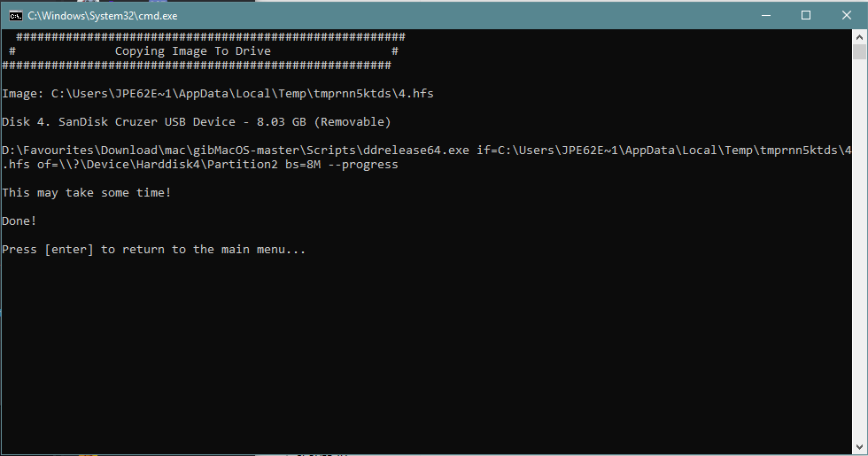

# Making your installer USB

## Windows

When the image has downloaded, it will be placed in a new folder called `macOS Downloads`. Make sure the file is there, we will need it later on.

u/CorpNewt has made a nice script to make an installer from the image.

In the same place where you just ran gibMacOS there is a nice little script called `MakeInstall.bat`. Double click it, accept the admin prompt and a CMD window will pop up. The software will download all it's requirements and will show you a list of available drives:

1. _**Very carefully**_ select your drive \(check for size, name etc\)
2. Type in your drive's number _**and add on  the letter `G`**_
3. Follow the instructions on screen.
4. When asked for the recovery image path:
   1. Shift + right click on the file
   2. `Copy as Path`
   3. Right click in the tool again to paste the path.
   4. Press Enter
5. Now let the tool do its job. This can take a while

When it is done you will be greeted with the following message:

_**Don't close the window. Press Enter. We'll need it later.**_

_\*\*\*\*_

Continue to the next part when this is done.

